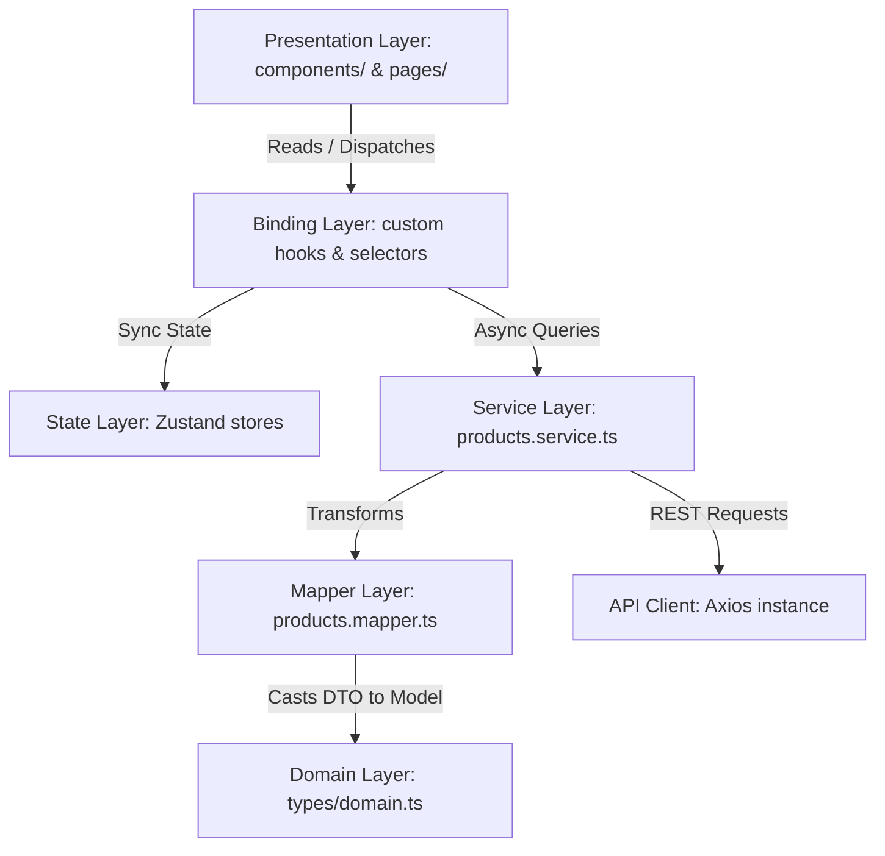

# Technical Architecture Document

Jnan Store is designed with a decoupled, feature-based **Clean Architecture** to ensure high performance, separation of concerns, strict type safety, and ease of long-term maintenance. 

---

## 1. Clean Architecture & Feature-Based Organization

Rather than traditional layered organization (grouping all components, then all hooks, then all pages), Jnan Store splits functionality by **functional business domains** under `src/features/`.

```
src/features/
├── auth/          # Authentication & verification features
├── cart/          # Cart management & slide-out sidebar
├── checkout/      # Address management, summary computation, and order completion
├── home/          # Home banners, featured items, and recommendations
└── products/      # Product displays, reviews, tabs, and image gallery
```

Each feature folder is self-contained. It groups UI components, hooks, services, and tests that belong to that domain. This minimizes directory hopping and allows features to be updated, refactored, or replaced independently.

---

## 2. Layered Separation of Concerns

The code is divided into logical layers. Each layer has a single responsibility and strictly defined dependencies.



### The Architectural Layers:

1. **Domain Layer (`src/types/domain.ts`)**: Contains pure TypeScript interfaces representing business entities (e.g., `Product`, `Category`, `User`, `Order`, `Coupon`, `Review`). This layer is framework-agnostic. It contains no dependencies on React, Zustand, React Query, or Axios.
2. **DTO Layer (`src/types/api.ts` & feature types)**: Defines **Data Transfer Objects** that mirror the exact payload structure returned by backend endpoints. This insulates our codebase from API changes.
3. **Mapper Layer (`src/services/*/name.mapper.ts`)**: Translates raw DTOs from the DTO layer into strongly typed Domain Models. If the backend changes a property name, we only need to update the mapper function, keeping the rest of the application unchanged.
4. **Service Layer (`src/services/`)**: Handles backend requests using the API Client, coordinates mapper invocations, and handles mock-data logic for local execution.
5. **State Layer (`src/store/`)**: Zustand stores managing client-only global parameters (active language, dark mode, shopping cart items, session tokens).
6. **Binding Layer (`src/hooks/`)**: Reusable hooks (e.g., `useProducts`, `useCart`) connecting presentation components to the underlying state store or TanStack Query.
7. **Presentation Layer (`src/components/`, `src/pages/`)**: Pure components that consume data and render the visual interface. They do not handle networking or direct data transformations.

---

## 3. SOLID Principles in Frontend React

Our engineering decisions align with the SOLID principles:

* **S - Single Responsibility Principle (SRP)**:
  - Components are kept small. For example, rather than having checkout cards calculate shipping, tax, discounts, and select addresses in a single file, these responsibilities are separated into `AddressSelector`, `CartSummary`, and a custom `QuantitySelector`.
  - Service files handle HTTP requests and data lookup, leaving UI rendering to components.
* **O - Open/Closed Principle (OCP)**:
  - Primitives like our custom `Button` or reusable `QuantitySelector` are open for layout styling adjustments via `className` utility merging (`tailwind-merge`), but closed for core behaviors.
* **L - Liskov Substitution Principle (LSP)**:
  - Common UI structures adhere to native element props. For instance, the generic `Input` component extends standard HTML input attributes (`React.InputHTMLAttributes<HTMLInputElement>`), ensuring it behaves identically to a native input button.
* **I - Interface Segregation Principle (ISP)**:
  - React components accept only the specific properties they require. Instead of passing an entire `Product` object to a sub-component that only needs to display a title, we pass just the `title` string.
* **D - Dependency Inversion Principle (DIP)**:
  - High-level components depend on abstract domain interfaces rather than concrete API response objects. Invocations to services are decoupled using custom React Query hooks.

---

## 4. Component Hierarchy & Layout Structure

The layout is split into shell wraps, code-split pages, and feature-scoped sub-components:

```
App Bootstrapper (App.tsx / AppRoutes.tsx)
  │
  ├── AuthLayout (Auth routes wrapper)
  │     └── LoginPage / RegisterPage / ForgotPasswordPage
  │
  └── DefaultLayout (Global storefront wrapper)
        ├── AnnouncementBar / Header (SearchBar, LanguageSwitcher, ThemeSwitcher)
        ├── Router Outlet (Active Page View)
        │     └── HomePage / ShopPage / ProductDetailsPage / CheckoutPage
        ├── Footer
        ├── MobileNavigation (Bottom sticky toolbar)
        └── MiniCartDrawer (Zustand-controlled slider drawer)
```

---

## 5. API Client & Security Configuration

The Axios client instance is instantiated in `src/lib/api/apiClient.ts` and configured with request/response interceptors:

* **Authorization Headers**: The request interceptor retrieves the current `accessToken` from the authenticated user store and injects it into the HTTP header dynamically (`Authorization: Bearer <token>`).
* **Error Interception**: Checks responses globally. In case of authentication failures (e.g., HTTP `401 Unauthorized`), the client triggers token refresh cycles or clears the store.
